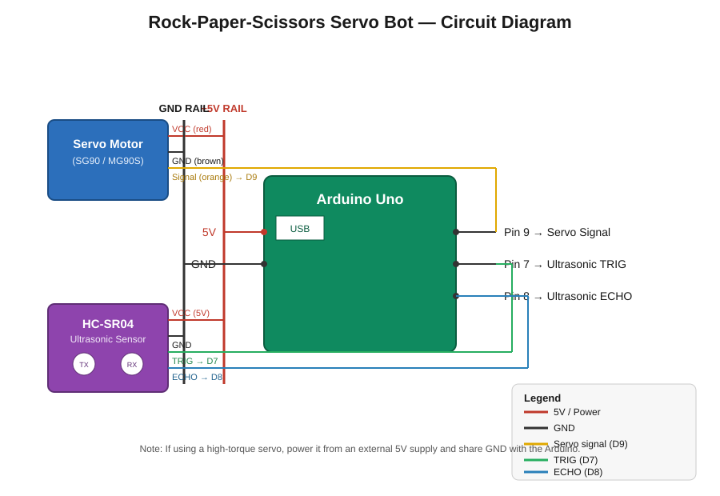

# Rock-Paper-Scissors Servo Bot (Arduino Uno)

An Arduino Uno project that combines an **HC-SR04 ultrasonic sensor** and a **servo motor** to play a simple Rock-Paper-Scissors style game. On power-up the servo resets to 0°. When the ultrasonic sensor detects an obstacle (e.g. your hand) within range, the servo randomly jumps to one of three positions — 0°, 90°, or 180° — representing Rock, Paper, or Scissors, holds that pose for 2 seconds, then resets back to 0° for the next round.

## How it works

1. On boot, the servo moves to **0°** and holds (confirmed over Serial: `Servo initialized at 0 degrees.`).
2. The Arduino continuously measures distance using the ultrasonic sensor.
3. If an obstacle is detected within `obstacleDistance` (default: 15 cm):
   - The servo picks a **random angle** from `{0, 90, 180}`.
   - It moves to that angle and holds for **2 seconds**.
   - It resets to 0° and waits for the next detection.

## Components

| Component | Qty |
|---|---|
| Arduino Uno | 1 |
| Servo motor (SG90 / MG90S or similar) | 1 |
| HC-SR04 ultrasonic sensor | 1 |
| Jumper wires | as needed |
| Breadboard (optional) | 1 |
| External 5V supply (recommended for larger servos) | 1 |

## Wiring

| Component Pin | Arduino Pin |
|---|---|
| Servo Signal | D9 |
| Servo VCC | 5V |
| Servo GND | GND |
| HC-SR04 TRIG | D7 |
| HC-SR04 ECHO | D8 |
| HC-SR04 VCC | 5V |
| HC-SR04 GND | GND |

See the full wiring diagram: [circuit-diagram.svg](circuit-diagram.svg)

> ⚠️ **Power note:** If you're using a larger/high-torque servo, power it from an **external 5V supply** instead of the Uno's onboard 5V pin, and connect the external supply's GND to the Arduino's GND (common ground). Drawing too much current from the Uno directly can cause brown-outs and upload/reset issues.

## Getting Started

1. Open `rps-servo-arduino.ino` in the Arduino IDE.
2. Select **Tools → Board → Arduino Uno**.
3. Select the correct **Tools → Port** (check Device Manager if unsure).
4. Wire the circuit as shown above.
5. Upload the sketch.
6. Open the **Serial Monitor** (9600 baud) to see detection logs.

## Configuration

- `obstacleDistance` (default `15` cm) — tune this in the sketch based on how close an object needs to be to trigger a move.
- `angles[]` — the three servo positions used for Rock (0°), Paper (90°), and Scissors (180°). Adjust to match your physical servo arm orientation.

## Troubleshooting

- **Upload fails / "programmer is not responding":** Disconnect the servo before uploading — it can draw enough current to cause voltage sag that interferes with the bootloader handshake. Reconnect after a successful upload.
- **Port not found:** Check Device Manager for the correct COM port; install the CH340 driver if using a clone Uno.
- **Erratic servo movement:** Confirm a solid common ground between the Arduino, servo, and ultrasonic sensor, especially when using an external power supply.

## License

MIT
